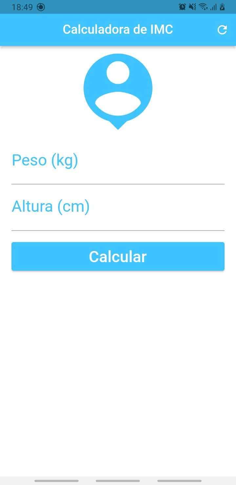
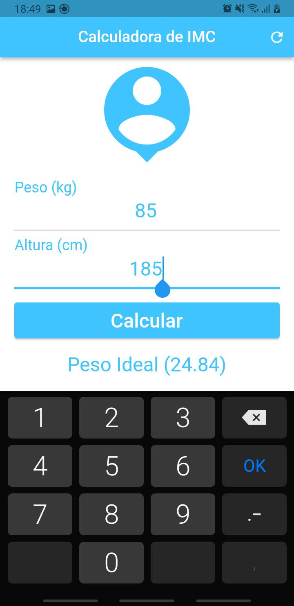
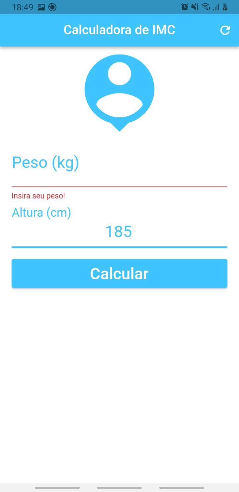

# calculadora_imc

My first Flutter project.

This simple app is for calculate the body mass index (IMC in portuguese) and learn more about Flutter.
And is my second app made with Flutter.
I've used the same widgets as the [previous one](https://github.com/henriqueparaguassu/contador_de_pessoas) and more: Scroolview, Scaffold, Appbar, Form, TextFormField and features like Controllers, GlobalKey, Validation, etc.

## Screenshots

For help getting started with Flutter, view our
[online documentation](https://flutter.dev/docs), which offers tutorials,
samples, guidance on mobile development, and a full API reference.
